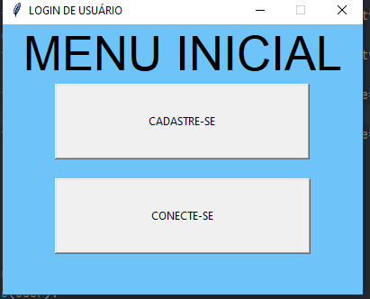
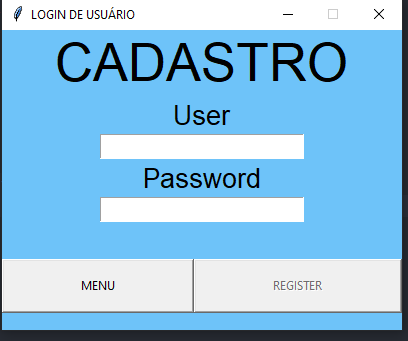
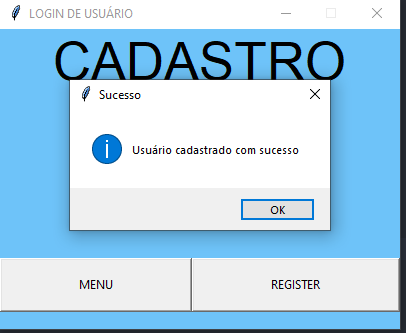
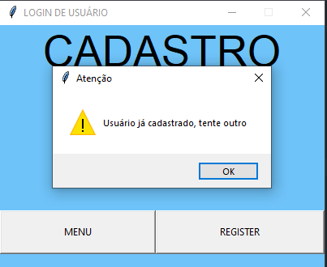
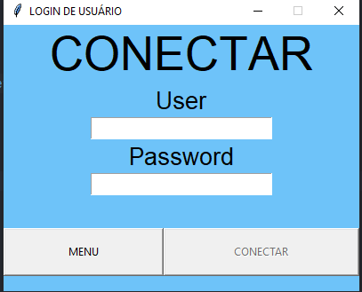
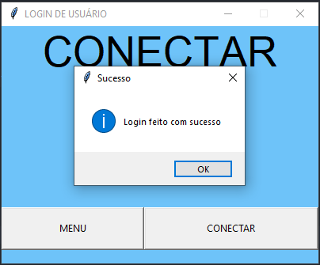
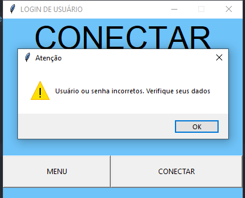
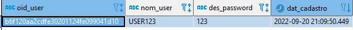
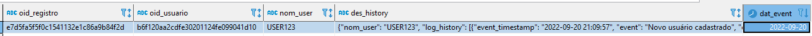

# Python - Sistema de cadastro
## Objetivos:
- Criar interface gráfica para cadastro 
- Armazenar os dados cadastrados em banco postgre
- Criar interface de login que buscará o usuário cadastrado
- Gerar logs de utilização do usuário

## Pré-requisitos:
- Banco de dados PostgreSQL
- python 3.6+
- json lib
- psycopg2 lib
- tkinter lib

## Funcionamento:
- Após o início da execução do script será criada uma ‘interface’ do menu
- O usuário poderá escolher entre cadastrar-se ou conectar-se a sua conta
- Caso opte pelo cadastro será lhe solicitado a inserção do usuário e senha
- Os dados inseridos serão armazenados na tabela cadastro_pessoa.tb_cadastro
- O usuário não poderá cadastrar mais de uma conta com o mesmo usuário
- Caso opte por se conectar será lhe solicitado o usuário e senha 
- Em caso de o usuário não estar cadastrado uma mensagem irá retornar
- Em caso de senha incorreta uma mensagem irá retornar
- Os seguintes eventos irão gerar logs que alimentarão a tabela cadastro_pessoa.tb_log_user:
  - Cadastro
  - Conectar-se
  - Usuário já cadastrado
  - Senha incorreta
  - Fechar janelas
- Os logs serão armazenados em formato JSON e serão agrupados por usuário e dia dos eventos

## Exemplos:
- Log do usuário:
  - ```json
      {
          "nom_user": "PATRICK_ALAN",
          "log_history": [
              {
                  "event_timestamp": "2022-09-18 00:44:35",
                  "event": "Novo usuário cadastrado",
                  "event_type": "SUCESSO"
              },
              {
                  "event_timestamp": "2022-09-18 00:44:37",
                  "event": "Usuário já cadastrado",
                  "event_type": "ERRO"
              },
              {
                  "event_timestamp": "2022-09-18 00:44:47",
                  "event": "Erro: Tentativa de login fracassada",
                  "event_type": "ERRO"
              },
              {
                  "event_timestamp": "2022-09-18 00:44:48",
                  "event": "Erro: Tentativa de login fracassada",
                  "event_type": "ERRO"
              },
              {
                  "event_timestamp": "2022-09-18 00:44:54",
                  "event": "Erro: Tentativa de login fracassada",
                  "event_type": "ERRO"
              },
              {
                  "event_timestamp": "2022-09-18 00:45:05",
                  "event": "Login realizado com sucesso",
                  "event_type": "SUCESSO"
              },
              {
                  "event_timestamp": "2022-09-18 00:45:06",
                  "event": "Fechar janelas",
                  "event_type": "SISTEMA"
              }
          ]
      }
      ```
- Menu:
  - 
- Tela de cadastro:
  - 
- Eventos de cadastro:
  - 
  - 
- Tela de conexão:
  - 
- Eventos de conexão:
  - 
  - 
- Tabela de cadastro:
  - 
- Tabela de logs:
  - 


